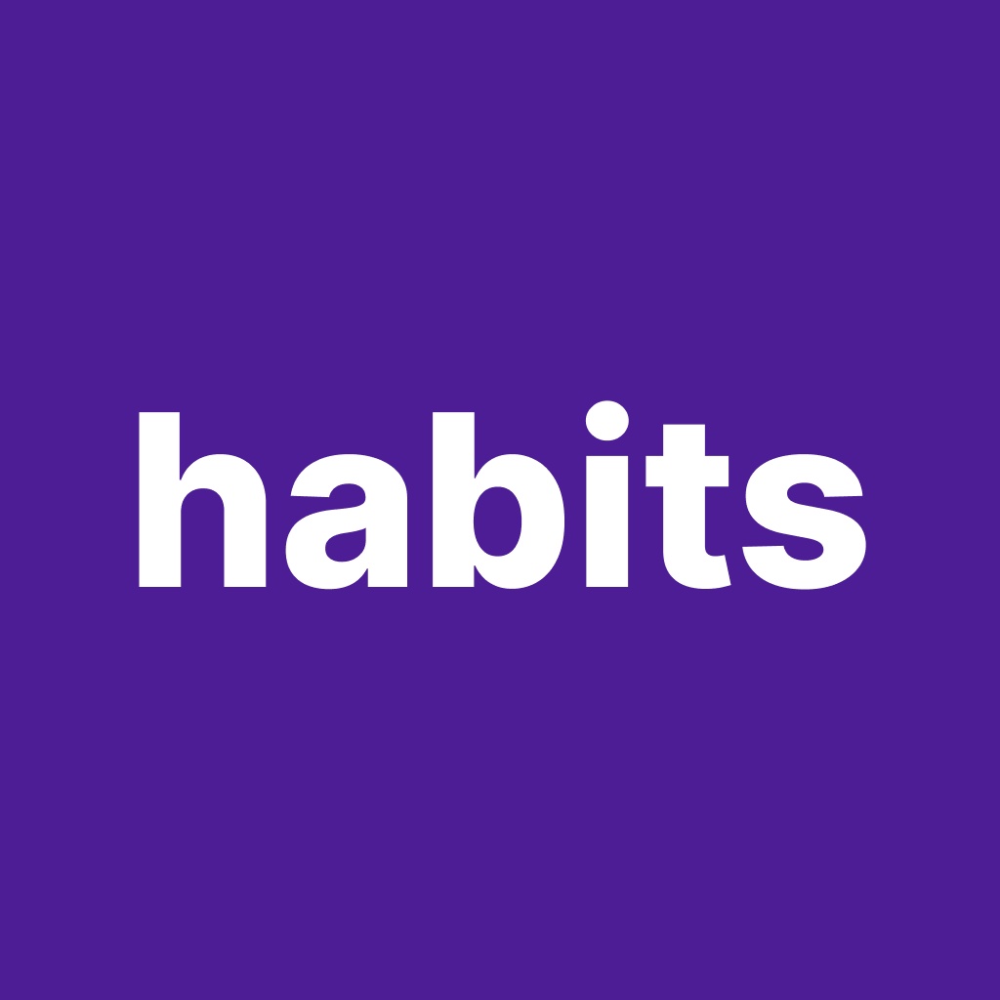

<p align="center">
    
</p>

##

<h4 align="center"> 
	🚧 NLW Setup - Habits 🚧
</h4>

<p align="center">
     
    
</p>
    
## 💻 Sobre o projeto

💡 Habits é um aplicativo para gerenciar hábitos.

## 🛠 Tecnologias

As seguintes ferramentas foram usadas na construção do projeto:

- Node.js
- React
- React Native
- Prisma ORM
- Expo GO

## 🏁 Pré-requisitos

Antes de começar, é preciso ter instalado em sua máquina as seguintes ferramentas:

- NPM
- Node.js
- Git
- expo-cli
- Expo GO (app a ser instalado no dispositivo Android e/ou iOS)

## 🚀 Como executar o projeto

```bash
# Clone este repositório
$ git clone https://github.com/alexandrerehder/habits

# Acesse a pasta do projeto no terminal/cmd
$ cd habits/

# Suba os containers (mercadolivre, postgres, rabbitmq)
$ sudo make up
```

## 📕 Documentação do projeto

(...)
